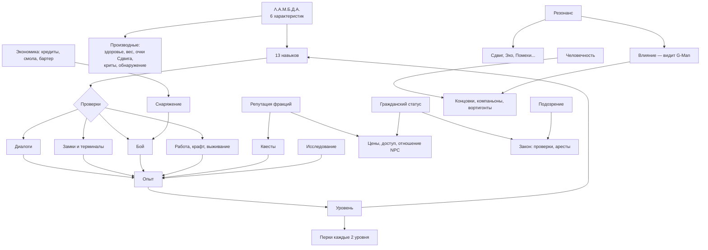

# 01. Обзор ролевой системы и принципы

> Part I задаёт **числа и правила**: на них ссылаются локации (Part II), квесты и диалоги (Part III) и сюжет (Part IV). Делать сейчас ничего не нужно — это проект. Привязка к уже существующему коду мода описана в файле `16_Интеграция_с_текущим_кодом.md`.

---

## 1. Состав системы



| Система | Файл | Коротко |
|---|---|---|
| Характеристики Λ.А.М.Б.Д.А. | 02 | Ловкость, Аналитика, Мощь, Бдительность, Дух, Авторитет (1–10) |
| Навыки | 03 | 13 навыков 0–100, специализации, книги, наставники |
| Черты и перки | 04 | 12 черт при создании, ~75 перков, импланты |
| Опыт и уровни | 05 | Кривая опыта до 30 уровня, нормы XP за всё |
| Репутация, Гражданский статус, Человечность, Резонанс, Влияние | 06 | Отношения со всеми силами + особые шкалы героя |
| Закон и преступления | 07 | Кодекс гражданина, свидетели, сканеры, арест, Нова Проспект |
| Экономика | 08 | Кредиты, пайки, смола, цены, зарплаты, инфляция по актам |
| Диалоги | 09 | Проверки, глупые диалоги при низкой Аналитике, формат данных |
| Взлом и доступ | 10 | Замки, мультитул, пропуска, маскировка |
| Бой, оружие, броня, крафт | 11 | Таблицы оружия и брони, улучшения на фабрикаторах, рецепты |
| Выживание и состояния | 12 | Травмы, радиация, споры Ксена, яд, режим выживания |
| Компаньоны (механика) | 13 | Колесо команд, одобрение, перки |
| Интерфейс | 14 | HUD, учётный браслет, меню |
| Работа, жильё, быт | 15 | Смены, зарплаты, квартиры, распорядок города |
| Интеграция с кодом | 16 | Что уже есть, что расширять |

---

## 2. Принципы дизайна систем

1. **Детерминированные проверки (как в New Vegas).** Проверка `[Красноречие 50]` проходит, если навык ≥ 50. Никаких скрытых процентов. Игрок видит требование и своё значение и сам решает, рисковать ли «красной» репликой.
2. **Минимум два решения у каждой задачи.** Бой плюс хотя бы одна альтернатива: скрытность, речь, наука, взлом, подкуп, обходной маршрут.
3. **Провал не тупик.** Неудачная проверка ведёт к другой ветке: дороже, опаснее, с потерей репутации. Сюжет не блокируется.
4. **Мир реагирует системно.** Сканер, сфотографировавший героя на месте преступления, — это не скрипт, а общая механика. Квест лишь подбрасывает ситуацию.
5. **Каждый навык нужен в каждом акте.** Нет «мёртвых» навыков: у Выживания есть городские применения, у Хакинга — пустошные.
6. **Атмосфера важнее цифр на экране.** Числа живут в браслете. В HUD — минимум, в стиле HL2.
7. **Совместимость с HL2.** На первом уровне с Духом 5 у героя ровно 100 здоровья, как у Гордона. Это позволяет переиспользовать баланс оригинальных NPC в начале игры.

---

## 3. Режимы сложности

| Режим | Название в игре | Отличия |
|---|---|---|
| Лёгкий | «Гражданин» | Урон по герою ×0,6; Подозрение спадает вдвое быстрее; компаньоны не умирают (только «без сознания»). |
| Нормальный | «Нарушитель» | Базовые значения всех таблиц. |
| Сложный | «Антигражданин» | Урон по герою ×1,5, урон героя ×0,85; торговцы дороже на 15%; сканеры чаще. |
| + Флаг | **«Режим выживания»** | Включаемый поверх любого: голод, жажда, сон; лечение растянуто во времени; патроны имеют вес; травмы лечит только врач или навык; компаньоны умирают навсегда; быстрое перемещение только между убежищами. |

Сложность можно менять в любой момент, кроме флага «Режим выживания»: снятый однажды, он не включается снова.

---

## 4. Основной игровой цикл

```
   Исследую сектор ──► нахожу людей, записки, тайники
         ▲                     │
         │                     ▼
  Мир меняется       Разговор → квест → выбор способа
  (акты, фракции,              │
   слайды финала)              ▼
         ▲             Проверки навыков / бой / торг
         │                     │
         └── последствия ◄─────┤
                               ▼
                  Опыт, награда, репутация, лут
                               │
                               ▼
               Уровень → навыки → перки → новые решения
```

---

## 5. Архетипы прохождения (для проверки баланса)

Каждый архетип должен проходить игру до любой доступной ему концовки:

| Архетип | Ключевые характеристики и навыки | Как живёт |
|---|---|---|
| **Образцовый гражданин** | Авторитет, Красноречие, Торговля | Работа, лояльность, карьера в Администрации; бой — минимум |
| **Офицер ГО** | Мощь, Ближний бой, Огнестрел, Красноречие | Карьера ГО → Надзор; концовка «Образцовый гражданин» |
| **Двойной агент** | Авторитет, Скрытность, Красноречие | Служит в ГО, сливает Лямбде; перк «Двойной агент» |
| **Подпольщик** | Ловкость, Скрытность, Взрывчатка | Тайники, диверсии, восстание |
| **Учёный Black Mesa** | Аналитика, Наука, Хакинг, Медицина | Решает задачи головой; раньше вспоминает прошлое |
| **Контрабандист** | Авторитет, Торговля, Взлом | Пайщики, каналы, «Последний барыш» |
| **Сталкер Пустоши** | Дух, Бдительность, Выживание, Огнестрел | Живёт за стеной: Списанные, Остаток, Хор |
| **Простак** | Аналитика 1–3 | Особые «глупые» диалоги, меньше подозрений, уникальные решения |
| **Пацифист** | Скрытность, Красноречие | Игра проходима **без единого убийства человека** (кроме неизбежных существ Ксена в отдельных эпизодах) |
| **Каратель** | Мощь, Импульсное оружие | Бойня; Человечность падает; путь к худшим концовкам |
