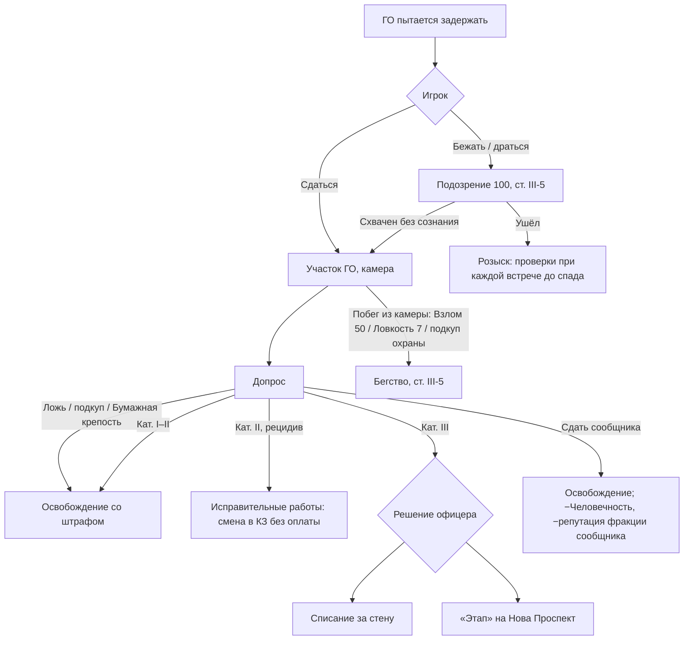

# 07. Закон Альянса и преступления

> В Fallout закон — это «карма плюс стража». В Сити-17 закон — это **машина**: сканеры, доносчики, голос Надзора, участок, поезд на Нова Проспект. Игрок должен **чувствовать надзор**, но иметь способы жить «между строк».

---

## 1. Кодекс гражданина [М] (на основе канонической лексики голоса Надзора)

### Категория I — «Нарушение порядка»
| Статья | Пример | Санкция |
|---|---|---|
| I-1 | Нахождение вне жилого блока в комендантский час | Штраф 25 кр., ГС −2 |
| I-2 | Бег, крик, «нецелевое передвижение» в зоне контроля | Устное предупреждение → ГС −1 |
| I-3 | Неподчинение устному распоряжению («Подберите банку») | Удар дубинкой, ГС −3 |
| I-4 | Мусор, порча мелкого имущества | Штраф 10 кр. |
| I-5 | Хранение самиздата | Конфискация, ГС −5 |
| I-6 | Собрание более трёх граждан без наряда | Разгон, ГС −2 всем |

### Категория II — «Антигражданская деятельность»
| Статья | Пример | Санкция |
|---|---|---|
| II-1 | Кража (у граждан, Альянса) | Штраф ×3 стоимости, ГС −10, задержание |
| II-2 | Хранение контрабанды: еда вне пайка, алкоголь, табак, лекарства без рецепта, **запрещённые книги**, довоенные пластинки | Конфискация, штраф 100–300 кр., ГС −10…−15 |
| II-3 | Проникновение в закрытую зону (склад, КЗ, депо) | Задержание, ГС −15 |
| II-4 | Подделка документов, использование чужого наряда | ГС −20, задержание, допрос |
| II-5 | Порча имущества Альянса (камера, сканер, раздатчик) | Штраф 200–500 кр., ГС −15 |
| II-6 | Взлом терминала, раздатчика | ГС −15, задержание |

### Категория III — «Социальная угроза» (*socio-endangerment*)
| Статья | Пример | Санкция |
|---|---|---|
| III-1 | Нападение на ГО, рабочего, служащего | ГС −35, арест |
| III-2 | Хранение оружия, патронов, взрывчатки | ГС −30, арест |
| III-3 | Антигражданская пропаганда: граффити λ, листовки, агитация | ГС −30, арест |
| III-4 | Пособничество беглецам и укрывательство незарегистрированных | ГС −40, арест |
| III-5 | Сопротивление аресту | ГС −40, бой |

### Категория IV — «Злостное неподчинение» (*capital malcompliance*)
| Статья | Пример | Санкция |
|---|---|---|
| IV-1 | Убийство ГО, солдата Надзора, служащего | **Антигражданин**, приказ «нейтрализовать» |
| IV-2 | Диверсия, теракт | То же |
| IV-3 | Доказанная связь с ядром Сопротивления | То же |
| IV-4 | Укрывательство Антигражданина №1 (Акт III–IV) | То же |

---

## 2. Свидетели и улики

| Свидетель | Что делает | Как нейтрализовать |
|---|---|---|
| **ГО, Надзор** | Немедленная реакция по уровню Подозрения/преступления | Скрыться, маскировка, взятка (только кат. I–II, только «продажные» юниты), убить (кат. IV) |
| **Сканер города** | Фото → «запись в базе»: преступление фиксируется даже без ГО рядом; через 2–5 игровых минут — патруль | Сбить до того, как он долетит до узла (порча имущества!), перехватить снимок (Хакинг 50 на терминале участка), черта/«Помехи» |
| **Камеры** (в зданиях Альянса) | Как сканер, но стационарно | Отключить (Хакинг), обойти, закрасить |
| **Рабочие и служащие** | Бегут к ГО | Запугать, подкупить, остановить |
| **Граждане-доносчики** | 1 из 5 граждан (Акт I) → 1 из 3 (Акт II) доносит ради ГС | Подкуп (10–30 кр.), Красноречие, перк «Свой в толпе» |
| **Повстанцы, Списанные** | ГО не доносят никогда | — |

**База учёта.** Каждое зафиксированное преступление записывается на **учётную карту** героя. Записи видит любой ГО при проверке документов. Как стереть:
- взлом терминала участка (Хакинг 75) — одна запись;
- подкуп регистратора через Пайщиков — 150 кр. за запись кат. I–II;
- новая личность: поддельная карта Пайщиков или «чистая» карта Лямбды — **полный сброс** записей, но и ГС → 0.

---

## 3. Задержание и арест

### Допрос (диалоговая сцена)
- Ведёт офицер ГО (в участке C17-08: офицер «Юнион-1»). Возможности игрока:
  - `[Красноречие 35/60]` — убедить, что недоразумение;
  - `[Торговля 40]` + кредиты — «добровольный взнос»;
  - `[Аналитика 8]` — поймать офицера на процедурной ошибке (перк «Бумажная крепость» делает это автоматически);
  - `[Дух 6]` — выдержать «стимулятор правды», не выдав сообщников;
  - сдать кого-то (реальный сообщник или выдуманный — во втором случае `[Красноречие 50]`);
  - молчать (кат. II и выше → исправработы/списание).
- Если в отряде **Даниэль «Виктор-6»**, он может «замолвить слово» (одобрение влияет).
- На пути ГО у героя есть **служебный иммунитет** за кат. I–II.

### Последствия
| Исход | Что происходит с игроком |
|---|---|
| Штраф | Кредиты списываются. Нет денег — долг на карте, Подозрение +10 при каждой проверке, пока не погашен |
| Исправительные работы | Телепорт на КПП Карантинной зоны: одна смена ИК без оплаты (опасно, но даёт XP); снаряжение изымается и лежит в «камере хранения» участка (можно выкупить за 50 кр.) |
| **Списание за стену** | Герой у ворот C17-18 без пайкового статуса. ГС = −40 («Злостный нарушитель»). Город закрыт до поддельных документов, помощи Лямбды или подкупа на воротах. Мини-сюжет: Списанные встречают «новенького» (связь с SPS-01) |
| **«Этап» на Нова Проспект** | Квест-цепочка «Этап»: поезд → побег из вагона (Ловкость/Взлом/Взрывчатка/Красноречие с охранником) → или прибытие в Нова Проспект → побег через корпуса (особый маршрут по карте PB-07). **Не game over.** В Актах III–IV, после падения НП, вместо этапа — «Автономное суждение» (бой). |

---

## 4. Голос Надзора о герое (система объявлений)

> Коды эфира для каждой статьи кодекса, полный банк объявлений и пороги Подозрения — Part III/17 (§5.3, §9, §10.6).

Голос Надзора озвучивает **реальные** действия игрока. Примеры триггеров:

| Событие | Объявление (шаблон) |
|---|---|
| Подозрение 100 в жилом квартале | «Вниманию жильцов: в районе замечен нарушитель. Код: изолировать, раскрыть, исполнить». |
| Герой укрылся в доме, ГО не нашла | «Вниманию жильцов блока [N]: вашему блоку вменяется попустительское бездействие. Вычтено пять рационных единиц». (Жильцы блока потом злятся на героя.) |
| ГС «Антигражданин» | «Всем наземным группам защиты: идентифицирован антигражданин. Статус: злокачественный. Код: ампутировать, обнулить, подтвердить». |
| Герой донёс на соседа | «Вниманию жильцов: сотрудничество с Гражданской обороной гарантирует полную выдачу рационов». (На следующий день — сосед исчез.) |

---

## 5. Коррупция

- **Продажные юниты ГО**: каждый генерик-ГО имеет скрытый флаг «берёт» (Акт I: 30%, Акт II: 45%, Акт III: 20% — все боятся, Акт IV: —). Офицеры берут реже, но дороже.
- Базовые взятки: кат. I — 30 кр., кат. II — 120 кр., кат. III — 400 кр. (только офицер, только Акты I–II).
- Неудачная взятка: Подозрение +20 и статья II-4 «попытка подкупа» (с перком PK-16 — без последствий).
- **Сержант Гэннон** («Юнион-9») берёт всегда, но запоминает, сколько ты должен.

---

## 6. Закон вне города

Альянс за стеной — только патрули Надзора: они не арестовывают, а стреляют в любого без наряда.
Свои законы у фракций:

| Фракция | Главный закон | Наказание |
|---|---|---|
| Списанные | «Не кради у своих», «делись водой» | Изгнание из посёлка (репутация −30) |
| Остаток | Устав, приказ, «не тронь гражданских» | Разжалование, расстрел за мародёрство (для членов) |
| Вольница | «Сильный берёт» | Поединок с атаманом |
| Хор | «Не разрывай нить» (не убивай без нужды) | Молчание: вортигонты перестают говорить |
| Садовники | «Не трогай Сад» | Ритуальная «прививка» спорами (бой) |
| Пайщики | «Долг свят» | Коллекторы, затем «пропажа» |
