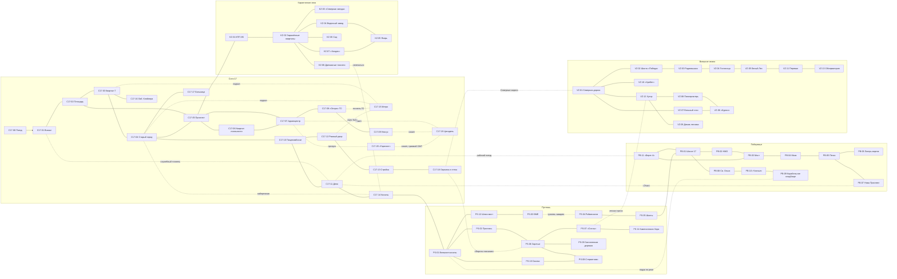

# 02. Карта мира

> Карта ниже — схема **мода**: регионы, сектора и связи. Она опирается на канон (Part 0/05), но расставляет места так, чтобы мир был удобен для открытой игры. ❗ Обзорная картинка всех карт HL2, о которой шла речь в задании, к сообщению не приложилась. Схема построена по канонической связности глав. Если картинку прислать, сверю и уточню расстояния и стыки.

---

## 1. Географическая схема региона Сити-17

```
                                   С Е В Е Р
     ▲▲▲ горы ▲▲▲            ВНЕШНИЕ ЗЕМЛИ (VZ)                 ▲▲▲ горы ▲▲▲
     VZ-11 Перевал ── VZ-13 Обсерватория
          │
     VZ-05 БЕЛЫЙ ЛЕС ── VZ-04 Гостиница «Белый Лес» ── VZ-03 Радиовышка
          │                                                   │
     VZ-06 «Курган»     VZ-08 Пионерлагерь «Ласточка»     VZ-02 Шахта «Победа»
     (Остаток)               │                                │
          │             VZ-12 Хутор «Три сосны» ── VZ-09 Домик лесника
     VZ-07 Вольный стан      │                                │
          └─────────── VZ-01 СЕВЕРНАЯ ДОРОГА ─────────── VZ-10 Аванпост «Хребет»
                               │  (Северные ворота)
 ═════════════════════════════╪══════ ВНЕШНЯЯ СТЕНА СИТИ-17 ══════════════════════
  КАРАНТИННАЯ        │  C17-19 ЦИТАДЕЛЬ ── C17-09 Нексус ── C17-20 НИИ «Горизонт»
  ЗОНА (KZ)          │  C17-07 Админцентр ── C17-08 Сектор «Опора» (ГО)
  KZ-01 КПП ИК ──────┤  C17-06 Квартал лояльности
  KZ-02…KZ-08        │  C17-05 Проспект Благодетелей (трамвай)
  (запад города)     │        │
  C17-00 Поезд ─► C17-01 ВОКЗАЛ ─ C17-02 Площадь ─ C17-03 Квартал 7 ─ C17-04 СТАРЫЙ ГОРОД ─ C17-17 Больница
                     │                             C17-16 Лаб. Кляйнера   │
                     │                                                    │
           ж/д ── C17-11 Депо ─ C17-10 Пищекомбинат ─ C17-12 Ржавый двор ─ C17-13 Стройка
                     │        C17-15 МЕТРО (под городом)        C17-14 КАНАЛЫ ──────┐
  C17-18 ОКРАИНА (по периметру; «Ворота списания» на востоке)                       │
 ═════════════════════╪══════════════════════════════════════════════════════════╪══
                      │ ж/д на юго-восток                         каналы → восток │
                      ▼                                                          ▼
   ПОБЕРЕЖЬЕ (PB)                                                 ПУСТОШЬ (PS)
   PB-11 Аванпост «Берег-4»                PS-01 Внешние каналы ── PS-02 Пристань Перевозчика
   PB-01 Шоссе 17 (север) ─ PB-08 Св. Ольга    │             └── PS-10 Свалка у шлюза
       │                     PB-10 «Чаячье» ─ PB-09 Корабельное кладбище ◄─ (лодки по реке)
   PB-02 Новая Малая Одесса                PS-12 Шлюз-мост Альянса
   PB-03 Ж/д мост                          PS-03 ПЛОТИНА / BLACK MESA EAST
   PB-04 Маяк                              PS-04 РЭЙВЕНХОЛМ ── PS-05 Шахты ──► (на Побережье)
   PB-05 Песчаные ловушки ─ PB-06 Лагерь вортигонтов   PS-06 Заречье ─ PS-07 Санаторий «Сосны»
   PB-07 НОВА ПРОСПЕКТ (мыс)               PS-08 Логово Стервятников   PS-09 Затопленная деревня
                                           PS-11 Каменоломня Хора
                                   Ю Г  /  М О Р Е
```

**Масштаб условный.** Ориентиры: от вокзала до Цитадели ≈ 2 км (в скайбоксе), от города до BME ≈ 25 км по каналам, от шахт Рэйвенхолма до Нова Проспекта ≈ 30 км по Шоссе 17, от Северных ворот до Белого Леса ≈ 40 км. Игрок проходит не «километры», а **сектора**: между ними опускается неинтересная дорога (аналог расстояний на карте Fallout).

---

## 2. Регионы

| Код | Регион | Секторов | Характер | Опасность | Главные силы |
|---|---|---|---|---|---|
| **C17** | Сити-17 | 21 | Плотный город, закон, работа, интриги | Низкая → высокая к Акту IV | Альянс, Лямбда, Пайщики, Косари, Ржавые |
| **KZ** | Карантинная зона | 8 | Город, отданный Ксену; хоррор, выживание | Высокая | ИК, Садовники, отшельники |
| **PS** | Пустошь | 12 | Каналы, болота, мёртвые деревни, плотина, Рэйвенхолм | Средняя–высокая | Проводники, Списанные, Хор, Стервятники |
| **PB** | Побережье | 11 | Обмелевшее море, пески, шоссе, тюрьма | Средняя–высокая | НМО, Надзор, Хор, «Водяные» |
| **VZ** | Внешние земли | 13 | Хвойные леса, горы, хутора, военные объекты | Средняя | Белый Лес, Остаток, Вольница |
| **SP** | Особые локации | 8 | Black Mesa, Ксен, Арктика, лимб G-Man, воспоминания | Сюжетная | — |
| | **Итого** | **73 сектора** | + ~80 интерьеров и точек интереса внутри | | |

---

## 3. Индекс секторов

| ID | Сектор | Тип | Размер | Акты |
|---|---|---|---|---|
| C17-00 | Поезд (вступление) | Сюжет | Интерьер | Пролог |
| C17-01 | Вокзал («Центр приёма рабочей силы») | Хаб | Средний | I–IV |
| C17-02 | Привокзальная площадь | Хаб | Средний | I–IV |
| C17-03 | Квартал 7 («Семёрка») | Жилой, старт | Средний | I–IV |
| C17-04 | Старый город | Хаб «подполья» | Средний | I–IV |
| C17-05 | Проспект Благодетелей | Транзит, трамвай | Средний (длинный) | I–IV |
| C17-06 | Квартал лояльности | Жилой | Малый | I–IV |
| C17-07 | Административный центр и Площадь Цитадели | Хаб Альянса | Средний | I–IV |
| C17-08 | Сектор «Опора»: участок ГО №3, казармы | Военизированный | Средний | I–IV |
| C17-09 | Нексус Надзора | Военный объект | Средний | II–IV (доступ) |
| C17-10 | Пищекомбинат №1 | Промышленный | Средний | I–IV |
| C17-11 | Технический вокзал и депо | Промышленный | Большой | I–IV |
| C17-12 | Ржавый двор и старая ТЭЦ | Промышленный | Средний | I–IV |
| C17-13 | Стройплощадка Альянса и страйдерный док | Промышленный | Средний | I–IV |
| C17-14 | Каналы Сити-17 | Подземный/коридорный | Максимальный (длинный) | I–IV |
| C17-15 | Метро и подземные тоннели | Подземный | Большой | I–IV |
| C17-16 | Лаборатория Кляйнера | Интерьер [К] | Интерьер | I–IV (по пути) |
| C17-17 | Городская больница №2 | Интерьер+двор | Малый | I–IV |
| C17-18 | Окраина и Внешняя стена | Пограничный | Большой (длинный) | I–IV |
| C17-19 | Цитадель: нижние уровни | Сюжет | Большой | III–IV |
| C17-20 | НИИ «Горизонт» (ОАЯ) | Научный | Средний | I–IV |
| KZ-01 | КПП и база Инфестационного контроля | Хаб ИК | Малый | I–IV |
| KZ-02 | Заражённые кварталы | Дикая зона | Большой | I–IV |
| KZ-03 | Гостиница «Северная звезда» [К] | Подземелье | Средний | I–IV |
| KZ-04 | Водочный завод [К] | Подземелье | Средний | I–IV |
| KZ-05 | Якорь (бывшая площадка Хранилища) | Сюжет | Средний | I–IV |
| KZ-06 | Оранжерея — «Сад» Садовников | Логово | Малый | I–IV |
| KZ-07 | Перерабатывающий завод «Холден» [К] | Подземелье | Средний | I–IV |
| KZ-08 | Дренажные тоннели [К] | Подземный | Средний | I–IV |
| PS-01 | Внешние каналы | Коридорный, лодка | Максимальный | I–IV |
| PS-02 | Пристань Перевозчика | Хаб Проводников | Малый | I–IV |
| PS-03 | Плотина и Black Mesa East [К] | Хаб Лямбды | Средний | I–III (руины в III–IV) |
| PS-04 | Рэйвенхолм [К] | Мёртвый город | Большой | I–IV |
| PS-05 | Шахты Рэйвенхолма [К] | Подземный | Средний | I–IV |
| PS-06 | Заречье | Посёлок Списанных | Малый | I–IV |
| PS-07 | Санаторий «Сосны» | Хаб Списанных | Средний | I–IV |
| PS-08 | Логово Стервятников (завод «Красный химик») | Логово | Средний | I–IV |
| PS-09 | Затопленная деревня | Дикая зона | Средний | I–IV |
| PS-10 | Свалка у шлюза | Дикая зона | Малый | I–IV |
| PS-11 | Каменоломня Хора | Хаб вортигонтов | Малый | I–IV |
| PS-12 | Шлюз-мост Альянса | КПП Альянса | Малый | I–IV |
| PB-01 | Шоссе 17: северный участок [К] | Трасса | Максимальный | I–IV |
| PB-02 | Новая Малая Одесса [К] | Посёлок | Малый | I–IV |
| PB-03 | Железнодорожный мост [К] | Трасса | Большой | I–IV |
| PB-04 | Маяк [К] | Укрепление | Малый | I–IV |
| PB-05 | Песчаные ловушки [К] | Дикая зона | Большой | I–IV |
| PB-06 | Лагерь вортигонтов [К] | Лагерь | Малый | I–IV |
| PB-07 | Нова Проспект [К] | Крепость-подземелье | Большой | I–III (руины в IV) |
| PB-08 | Св. Ольга (посёлок и монастырь) [Д] | Посёлок | Средний | I–IV (обстрел в II) |
| PB-09 | Корабельное кладбище | Логово «Водяных» | Средний | I–IV |
| PB-10 | Рыбацкий посёлок «Чаячье» | Посёлок | Малый | I–IV |
| PB-11 | Аванпост Надзора «Берег-4» | Военный объект | Средний | I–IV |
| VZ-01 | Северная дорога | Трасса | Максимальный | I–IV |
| VZ-02 | Шахта «Победа» [К] | Подземелье | Большой | I–IV |
| VZ-03 | Радиовышка [К] | Посёлок | Малый | I–IV |
| VZ-04 | Гостиница «Белый Лес» [К] | Точка | Малый | I–IV |
| VZ-05 | Белый Лес [К] | Хаб Лямбды | Средний | II–IV, пост-игра |
| VZ-06 | Бункер «Курган» | Хаб Остатка | Средний | I–IV |
| VZ-07 | Вольный стан | Хаб Вольницы | Средний | I–IV |
| VZ-08 | Пионерлагерь «Ласточка» | Дикая зона | Средний | I–IV |
| VZ-09 | Домик лесника | Дом игрока | Малый | I–IV |
| VZ-10 | Аванпост Альянса «Хребет» | Военный объект | Средний | I–IV |
| VZ-11 | Горный перевал и метеостанция | Дикая зона, снег | Средний | I–IV |
| VZ-12 | Хутор «Три сосны» | Посёлок | Малый | I–IV |
| VZ-13 | Обсерватория «Звёздная» | Точка | Малый | I–IV |
| SP-00 | Сон в поезде | Сюжет | — | Пролог |
| SP-01 | Воспоминания: Black Mesa, Сектор F | Сюжет | Средний | I–III (вспышки) |
| SP-02 | Нью-Мексико: поверхность Black Mesa | Особая | Большой | II+ (пасхалка), III (сюжет) |
| SP-03 | Руины Black Mesa: глубины Сектора F | Особая | Большой | III |
| SP-04 | Ксен: пограничные острова | Особая | Большой | II (пасхалка), III (сюжет) |
| SP-05 | Арктика: станция Aperture «Борей-3» | Пасхальная | Средний | II+ |
| SP-06 | Лимб — «пространство G-Man» | Сюжет | — | III, финал |
| SP-07 | Хранилище-2 | Сюжет (часть C17-19) | Средний | IV |

---

## 4. Граф связей секторов



---

## 5. Доступность регионов по актам

| Регион | Акт I | Акт II | Акт III | Акт IV | Пост-игра |
|---|---|---|---|---|---|
| Город (законно) | Почти весь (кроме C17-09, C17-19) | Больше КПП, Нексус по службе | Военное положение: кварталы закрываются | Линия фронта: зависит от фракции | Руины (опционально) |
| Карантинная зона | Через ИК или нелегально | То же | То же | Ксен вырывается за стены (атмосфера) | — |
| Пустошь | Каналами (нелегально), через «Ворота списания» | То же; облавы на Проводников | BME пала (День 1) | Беженцы | Доступна |
| Побережье | Через шахты или рабочим поездом | Св. Ольга обстреляна | Нова Проспект пал (День 3) | Надзор отходит | Доступно |
| Внешние земли | Через Северные ворота (наряд или подкуп) | Белый Лес открывается Лямбде | Оживление Остатка и Вольницы | Беженцы, бои | **Основной регион пост-игры** |
| Особые | Сон, вспышки | «Неточная наука» (США, Арктика, Ксен — коротко) | Black Mesa, Ксен, лимб | Хранилище-2, финал у G-Man | — |
