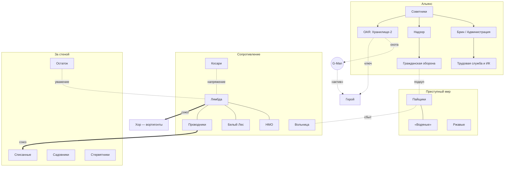

# 01. Обзор фракций и их отношений

> В оригинальной HL2 мир прост: Альянс — враг, Сопротивление и граждане — друзья. Мод раскрывает **серую** сложность: у Альянса есть люди, которым он кажется меньшим злом; у Сопротивления — кланы, которым плевать на человечество; у преступников — свой кодекс; за стеной — свои государства. Механика отношений — Part I/06.

---

## 1. Карта сил

---

## 2. Сводная таблица

| Фракция | Код | Кто они | Чего хотят | Лидер | Штаб | Как вступить | Финал фракции |
|---|---|---|---|---|---|---|---|
| **Альянс: Администрация** | (ГС) | Служащие-люди при Брине | Порядок, карьера, выживание «внутри системы» | Администратор Эдмунд Лорх | C17-07 | AD-01 «Образцовая анкета» | «Образцовый гражданин» |
| **Альянс: ГО** | (ГС, звание) | Полиция-добровольцы | Власть, пайки, «чтобы не стало хуже» | Офицер «Юнион-1» Ольгерд Шульц | C17-08 | GO-01 «Добровольцы» | «Образцовый гражданин» → пост-игра за Надзор |
| **Альянс: Трудовая служба и ИК** | (ГС, разряд) | Рабочие и хазмат-бригады | Зарплата, «право на перевод», выжить | Бригадир Оксана Ветрова | C17-13, KZ-01 | RB-01 «Бригада» | Слайды рабочих |
| **Альянс: ОАЯ** | — | Учёные-коллаборационисты | Хранилище-2 → отмена поля подавления | Доктор Тадеуш Квятковский | C17-20 | Только сюжетом | Развязка MQ-19 |
| **Лямбда** | `lambda` | Ядро Сопротивления: учёные Black Mesa, их сеть | Свобода человечества, победа над Альянсом | Вера Ланская (город); Илай, Кляйнер, Магнуссон [К] | C17-04, PS-03, VZ-05 | LM-01 «Знак лямбды» | «Свободный человек» |
| **Проводники** | `ferrymen` | Перевозчики беглецов по каналам | Спасать людей, а не воевать | Харитон «Перевозчик» Мельник | PS-02 | PR-01 «Перевозчик» | Слайды беглецов |
| **Косари** | `reapers` | Радикальный клан | Тотальная война, смерть «шкурам»-коллаборационистам | Ян «Косарь» Скорик | C17-15 «Цех №4» | KS-01 «Кровь за кровь» | Слайд (или уничтожение) |
| **Вольница** | `freefolk` | Бандиты под флагом λ | Власть и дань во Внешних землях | Анатолий «Батя» Грач | VZ-07 | VL-01 «Дань» | «Вольная земля» (тёмный вариант) |
| **Хор** | `chorus` | Свободные вортигонты | Порвать цепи, «замкнуть круг» камня-сердца | Слушающий | PS-11 | MQ-04 / VR-01 | Защита от «Изъятия» |
| **Пайщики** | `shareholders` | Мафия: пайки, контрабанда, документы | Прибыль и выживание при любой власти | Бронислав Кадар | C17-04 «Бани» | SM-01 «Баня» | «Последний барыш» |
| **Ржавые** | `rust` | Разборщики металла и техники | Свобода, детали, «свой двор» | Ржавая Марта | C17-12 | RZ-01 «Металлолом» | «Вольная земля» / слайды |
| **Списанные** | `writtenoff` | Выдворенные за стену | Выжить, вернуть достоинство | Матушка Агата, дед Ефим | PS-07, PS-06 | SPS-01 «Новенькие» | «Вольная земля» (светлый вариант) |
| **Остаток** | `remnant` | Ветераны HECU и местной армии | Последний бой с Альянсом, искупление | Мастер-сержант Харлан Пирс | VZ-06 | OS-01 «Позывной» | «Вольная земля» (военный вариант) |
| **Садовники** | `gardeners` | Культ флоры Ксена | «Сад» вместо мира людей | Сестра Аглая | KZ-06 | SD-01 «Цветение» | Слайд КЗ |
| **Стервятники** | — | Мародёры | Грабёж | «Клык» | PS-08 | Нет (всегда враги) | — |
| *Линия Aperture* | — | Инженер-изгнанник и ИИ станции | Узнать правду о «Борее» | Хьюго Брандт | C17-11 | AP-01 | Слайд |

---

## 3. Взаимоисключения (когда приходится выбирать)

| Действие | Что закрывается |
|---|---|
| Ранг ГО «Юнит 3-го класса» и выше **без** перка «Двойной агент» | Линия Лямбды и Проводников после LM-03 (знают, кто ты). С перком — двойная игра до конца Акта II |
| GO-06 «Рейд на Пристань» (выполнен честно) | Проводники — «Враг»; Списанные −30 |
| KS-02 «Огонь по участку» (выполнен) | Линия ГО закрыта; Лямбда −20; Администрация ищет героя |
| GO-10 «Протокол «Жнец»» | Косари уничтожены (или враги навсегда) |
| SM-07 «Последний барыш» | Финалы Лямбды и Альянса невозможны в «чистом» виде (герой «ушёл с деньгами») |
| Принять «Контракт» G-Man (MQ-16) | Все финалы ведут к концовке «Контракт» (с фракционными слайдами) |
| VL-02 — поддержать «Рябого» | Вольница становится союзником Стервятников; Остаток и Списанные — враги |
| SD-03 — защитить Матерь | ИК и Альянс → герой «Антигражданин» в КЗ; Лямбда −15 |

До середины Акта II можно спокойно работать почти на всех. Чем дальше, тем жёстче мир заставляет выбирать.

---

## 4. Сила фракций по актам

| Фракция | Акт I | Акт II | Акт III | Акт IV |
|---|---|---|---|---|
| Альянс | ██████████ | ██████████ | ████████ | ████ (падает) |
| Лямбда | ████ | █████ | ██████ | █████████ |
| Косари | ██ | █████ (на волне злости) | ████ | ⚑ |
| Пайщики | ██████ | ████████ (дефицит) | ██████ | ███ → ⚑ «барыш» |
| Ржавые | ████ | ████ | ███ | ⚑ |
| Списанные | ██ | ████ (приток) | █████ | ██████ |
| Остаток | ██ (тайна) | ███ | ████ | ⚑ |
| Вольница | ████ | ████ | █████ | ⚑ |
| Хор | ██ | ███ | ████ | █████ |
| Садовники | ██ | ███ | ███ | ⚑ |

⚑ — зависит от действий героя.
