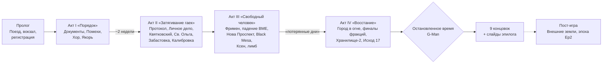

# 01. Синопсис и темы

> ⚠️ Полные спойлеры. Это «библия» сюжета для команды, а не текст для игрока.

---

## 1. Логлайн

Человек без памяти выходит из поезда в Сити-17 за семь недель до прибытия Гордона Фримена. Город живёт в «мирной» оккупации, но с каждым днём сжимается. Сканеры Альянса сбоят рядом с героем, вортигонты называют его «тем, кто нёс сердце-камень», а учёные Альянса строят **клетку для существа, которое когда-то спрятало его от мира**. К тому моменту, как Цитадель взорвётся, герой узнает правду: двадцать лет назад, будучи учёным Black Mesa, **он сам добыл на Ксене кристалл**, с которого начался конец света. И ему придётся решить, кому достанется мир, который он сломал. Если ему вообще позволят решать.

---

## 2. Синопсис (кратко)

**Пролог.** Сон с голосом G-Man. Поезд. Вокзал Сити-17. Героя нет в базе данных: «вы как будто не существуете». Тест профпригодности — создание персонажа. Имя, которое «пришло в голову». Комната 11 в Квартале 7.

**Акт I «Порядок» (День −49 … −30).** Город похож на Сити-17 из Half-Life: Alyx: работа, трамваи, очереди за пайком, стройки Альянса. Герой добывает документы (через Администрацию, Пайщиков, Лямбду или взлом), устраивается на работу, знакомится с соседями и фракциями. Сканеры сбоят рядом с ним. **Отдел аномальных явлений** (ОАЯ) вызывает его «на обследование». Вортигонты Хора зовут его во снах. В Карантинной зоне, на месте, где висело Хранилище из Alyx, герой видит первую вспышку прошлого (белые коридоры, люди в костюмах HEV) и **человека в костюме**, который останавливает время и говорит: «Не торопитесь, доктор». У героя появляется **Сдвиг** — способность замедлять время.

**Акт II «Затягивание гаек» (День −20 … −1).** Дожди. **Протокол семейного контроля**: из-за колебаний поля подавления (их вызывают кабели проекта ОАЯ) в городе несколько беременностей, и Альянс отвечает репрессиями. Начинаются «списания» за стену. Герой собирает своё **личное дело**: архивы, Кляйнер, Илай, информатор «Слухач», ветераны HECU с их **списком на уничтожение**, видения вортигонтов. Его бывший руководитель, доктор **Тадеуш Квятковский**, теперь глава ОАЯ, строит **Хранилище-2** — ловушку для G-Man — и просит помочь: след стазиса в теле героя — ключ к калибровке. Альянс обстреливает снарядами с хедкрабами прибрежную Св. Ольгу. Забастовка на пищекомбинате. В финале акта героя «калибруют» — добровольно, силой или ценой предательства. Вспышка: он сам передал кристалл «инспектору».

**Акт III «Свободный человек» (День 0 … +3, затем «потерянные дни»).** На вокзал прибывает Гордон Фримен — герой видит это со своей стороны. Падение Black Mesa East. Штурм Нова Проспекта: пока Гордон с Аликс и муравьиными львами ломают тюрьму, герой пробивается к **архиву ОАЯ** — и его экспериментальный телепорт, настроенный на «след», выбрасывает героя **в руины Black Mesa** в пустыне Нью-Мексико. Шкафчик с его именем. Его собственный костюм HEV. Аудиозапись, сделанная его голосом в день Инцидента. Полная память: группа погибла, пока он выполнял поручение G-Man; кристалл — его. Через телепорт Сектора F — на **Ксен**, к Колыбели кристалла и телам товарищей. Оттуда — в **лимб G-Man**, который подводит итоги, предлагает «Контракт» и возвращает героя в Сити-17 «к нужному моменту».

**Акт IV «Восстание» (≈ День +5 … +12).** Город в огне. Фримен пропал, потом вернулся. Нексус пал. Брин мёртв. Ядро Цитадели нестабильно (Episode One). Каждая фракция идёт к своему финалу: эвакуация, оборона, ограбление, исход за стену, «перерождение» в Надзор. Герой спускается в нижние уровни Цитадели к **Хранилищу-2**: уничтожить его, отдать Альянсу, отдать G-Man, попытаться поймать G-Man или пожертвовать собой. Бегство из города. Ударная волна. Время останавливается. «Время, доктор?» — финальный разговор с G-Man и одна из девяти концовок.

---

## 3. Темы

| Тема | Как звучит в сюжете | Как звучит в механике |
|---|---|---|
| **«Я просто выполнял поручение»** | Герой не спросил, зачем кристалл. Илай не прервал тест. Брин «продолжил». Пирс «выполнял приказ». Граждане поднимают банку | Почти каждый квест Альянса — «просто приказ». Последствия видны позже |
| **Цена порядка** | Альянс кормит, лечит и защищает от Ксена — и сжигает Св. Ольгу. В Акте IV он жертвует городом ради сигнала домой [К Ep1] | ГС даёт комфорт; Человечность за него платит |
| **Мир без детей** | Пустые качели, пионерлагерь, учительница без учеников, беременность как «сбой», надежда в эпилоге | Квесты SQ-23, SQ-62, слайды |
| **Память и вина** | Амнезия героя, «вода, от которой забываешь», вспышки, аудиожурнал | Резонанс, Эхо, флешбэки |
| **Свобода как ответственность** | «Свободный человек» в каноне — Гордон. Герой — человек, которому дают выбор, который он не хочет делать | Финальный выбор у Хранилища-2 и у G-Man |
| **Актив или человек** | Для G-Man, Альянса, Пайщиков герой — ресурс. Для Хора, соседей, компаньонов — человек | Влияние против Человечности |

---

## 4. Тон и референсы

- **Half-Life 2 / Episodes / Alyx**: атмосфера, юмор, страх, «невидимая» рука G-Man, сюжет через окружение.
- **Opposing Force, Blue Shift**: параллельная история к канону — «тот же день, другой человек».
- **Fallout: New Vegas**: фракции, репутация, «серые» решения, слайды эпилога.
- **Fallout 3**: внутриигровое создание персонажа (наш тест профпригодности).
- **Литература и кино** (как настроение): «Сталкер» Тарковского (Зона, тишина), «Дети человеческие» (мир без детей), «1984» (новояз, доносы).

---

## 5. Структура (схема)

